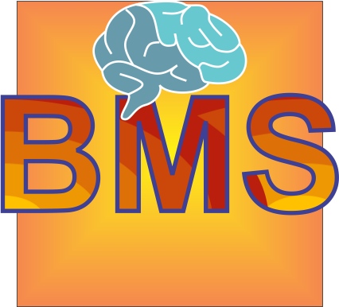

<a name="readme-top"></a>

<!-- PROJECT SHIELDS -->

<!-- [![Contributors][contributors-shield]][contributors-url] -->
<!-- [![Forks][forks-shield]][forks-url] -->
<!-- [![Stargazers][stars-shield]][stars-url] -->
<!-- [![Issues][issues-shield]][issues-url] -->
[](https://creativecommons.org/licenses/by-nc-sa/4.0/)
<!-- [![LinkedIn][linkedin-shield]][linkedin-url] -->


<!-- PROJECT LOGO -->

<br />
<div align="center">
  <a href="https://github.com/github_username/repo_name">
    
  </a>

<h3 align="center">BMSLogic</h3>
<p align="left">BMSLogic © 2024 by Moin Ahmed is licensed under Creative Commons Attribution-NonCommercial-ShareAlike 4.0 International <p> 


  <p align="center">
    Created by: Moin Ahmed 
    <br />
    Source code for the everything related to battery management systems (BMS), wriite mostly in Python and C++. The backend source code is mainly written in Python and C++.
    <!-- <br />
    <a href="https://github.com/github_username/repo_name"><strong>Explore the docs »</strong></a>
    <br />
    <br />
    <a href="https://github.com/github_username/repo_name">View Demo</a>
    ·
    <a href="https://github.com/github_username/repo_name/issues/new?labels=bug&template=bug-report---.md">Report Bug</a>
    ·
    <a href="https://github.com/github_username/repo_name/issues/new?labels=enhancement&template=feature-request---.md">Request Feature</a> -->
  </p>
</div>


<!-- TABLE OF CONTENTS -->

<details>
  <summary>Table of Contents</summary>
  <ol>
    <li>
      <a href="#about-the-project">About The Project</a>
      <ul>
        <li><a href="#built-with">Built With</a></li>
      </ul>
    </li>
    <li>
      <a href="#getting-started">Getting Started</a>
      <ul>
        <li><a href="#prerequisites">Prerequisites</a></li>
        <li><a href="#installation">Installation</a></li>
      </ul>
    </li>
    <li><a href="#usage">Usage</a></li>
    <li><a href="#roadmap">Roadmap</a></li>
    <li><a href="#contributing">Contributing</a></li>
    <li><a href="#license">License</a></li>
    <li><a href="#contact">Contact</a></li>
    <li><a href="#acknowledgments">Acknowledgments</a></li>
  </ol>
</details>


<!-- ABOUT THE PROJECT -->
## About The Project

<!-- [![Product Name Screen Shot][product-screenshot]](https://example.com) -->

This repository contains the source code for performing battery management system related simulations and calculations including battery cell, battery packs, and other system-level simulations.

<p align="right">(<a href="#readme-top">back to top</a>)</p>


<!-- GETTING STARTED -->
## Getting Started

The following contains the instructions for running this repository locally in this machine.

### Prerequisites

* Ensure your system has the following
    * Python with pip and venv installed
    * CMake

* Install Python project dependencies. <br>
  It is recommended to create a virtual Python environment for this project, especially if the functionalities supported by Python Language are to be used. For this purpose, follow the steps below:

  1. Create the Python virtual environment
      ```sh
      python -m venv venv
      ``` 

  2. Activate the virtual envinronment <br>
      On Windows:
      ```sh
      venv\Scripts\activate
      ```
      On macOS and Linux:
      ```sh
      source venv/bin/activate
      ```

  3. Verify Activation <br>
      Once activated, your command line prompt should prepend the name of the virtual environment, indicating that it's active. For example:
      ```sh
      (venv) user@hostname:~/path/to/repository$
      ```
  
  4. Install Python dependencies
      ```sh
      pip install -r requirements.txt
      ```


### Installation

1. Clone the repository
   ```sh
   git clone --recurse-submodules git@github.com:ChargeSage-Inc/BMSLogic.git
   ```
3. Build the C++ files using cmake
   ```sh
   cd build && mkdir build
   cmake ..
   cmake --build .
   ```

   To complie only C++ code (for example in embedded systems), set the ```cmake``` variable ```CPP_ONLY``` to ```ON``` via using the following command (instead of ```cmake ..``` above) 
   ```sh
   cmake .. -DCPP_ONLY=ON
   ```

   ### Tests

1. For python tests, run the following on the command line
   ```sh
   pytest tests
   ```
3. Google tests is used for testing the C++ code. Use the following
  to run the existing tests.
   ```sh
   cd cpp_tests
   ./bmslogic_tests   (on Linux)
   bmslogic.exe       (on Windows)
   ```

<p align="right">(<a href="#readme-top">back to top</a>)</p>
